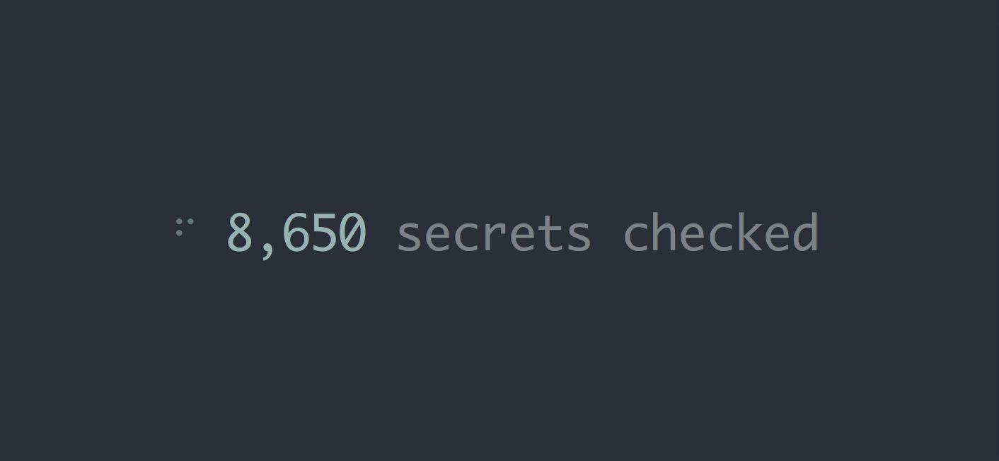

# jwt-secret [](https://travis-ci.org/timhudson/jwt-secret)

> Bruteforce a JWT against a list of passwords



Your [JWT](https://jwt.io/) is only as secure as the secret used to sign it.
Test a JWT against any arbitrary list of secrets.

## Install

Ensure you have [Node.js](https://nodejs.org) version 4+ installed. Then run the following:

```
$ npm install --global jwt-secret
```

## Usage

```
$ jwt-secret --help

  Usage
    $ jwt-secret <token>

    --file   Read secrets from file path
    --stdin  Read secrets from stdin

  Examples
    $ jwt-secret --file ./passwords.txt eyJhbGciOiJIUzI1...
    $ curl -sL https://git.io/vP5n1 | jwt-secret --stdin eyJhbGciOiJIUzI1...
```

## Secrets

Secrets must be newline separated. Try using a list from [SecLists](https://github.com/danielmiessler/SecLists/tree/master/Passwords).

**Example:**

```
123456
password
12345678
qwerty
123456789
12345
1234
111111
1234567
dragon
```

## License

MIT © Tim Hudson
